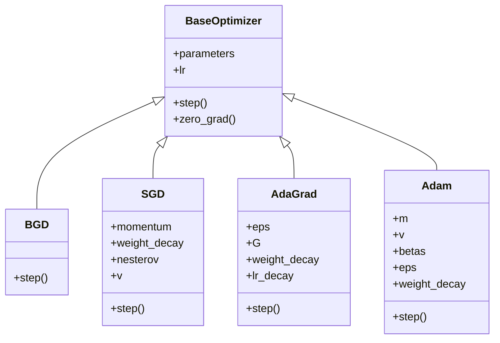
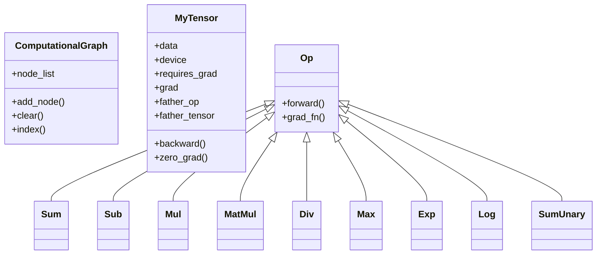
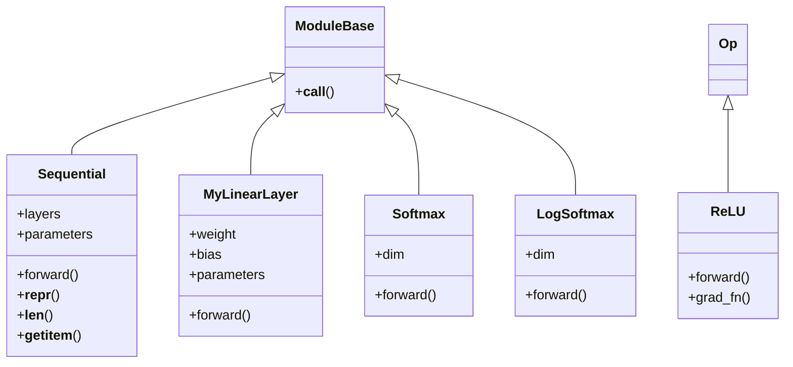
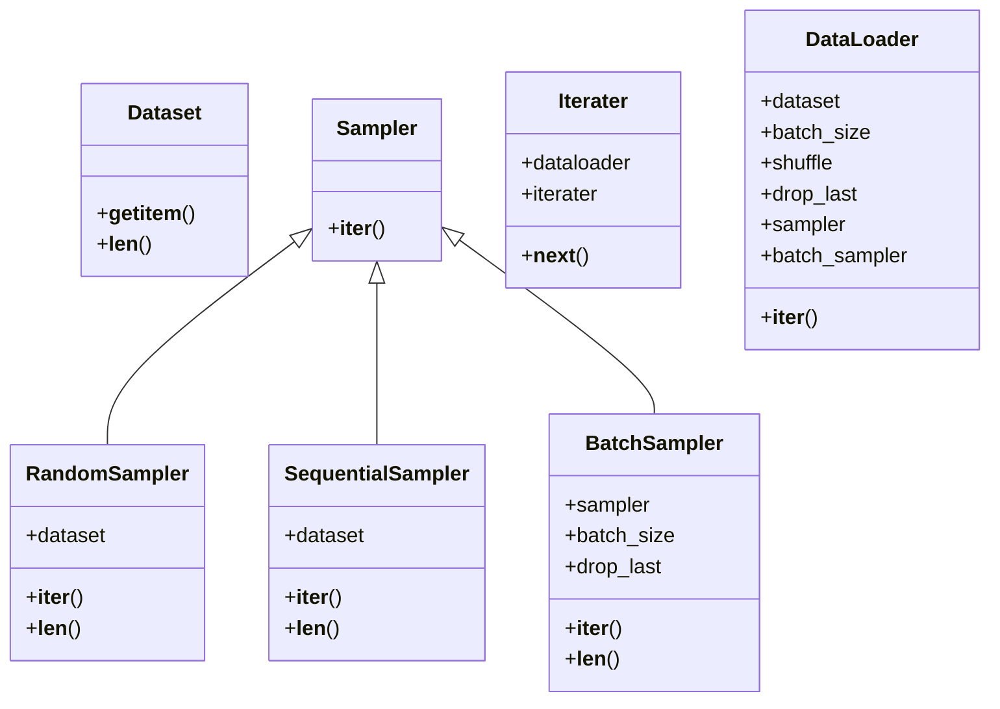
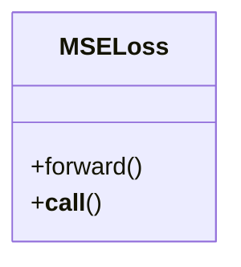

# MyTorch类继承关系图

## 优化器模块

```mermaid
classDiagram
    class BaseOptimizer {
        +parameters
        +lr
        +step()
        +zero_grad()
    }
    class BGD {
        +step()
    }
    class SGD {
        +momentum
        +weight_decay
        +nesterov
        +v
        +step()
    }
    class AdaGrad {
        +eps
        +G
        +weight_decay
        +lr_decay
        +step()
    }
    class Adam {
        +m
        +v
        +betas
        +eps
        +weight_decay
        +step()
    }
    
    BaseOptimizer <|-- BGD
    BaseOptimizer <|-- SGD
    BaseOptimizer <|-- AdaGrad
    BaseOptimizer <|-- Adam
```

## 张量和操作模块

```mermaid
classDiagram
    class ComputationalGraph {
        +node_list
        +add_node()
        +clear()
        +index()
    }
    
    class MyTensor {
        +data
        +device
        +requires_grad
        +grad
        +father_op
        +father_tensor
        +backward()
        +zero_grad()
    }
    
    class Op {
        +forward()
        +grad_fn()
    }
    
    class Sum
    class Sub
    class Mul
    class MatMul
    class Div
    class Max
    class Exp
    class Log
    class SumUnary
    
    Op <|-- Sum
    Op <|-- Sub
    Op <|-- Mul
    Op <|-- MatMul
    Op <|-- Div
    Op <|-- Max
    Op <|-- Exp
    Op <|-- Log
    Op <|-- SumUnary
```

## 神经网络模块

```mermaid
classDiagram
    class ModuleBase {
        +__call__()
    }
    
    class Sequential {
        +layers
        +parameters
        +forward()
        +__repr__()
        +__len__()
        +__getitem__()
    }
    
    class MyLinearLayer {
        +weight
        +bias
        +parameters
        +forward()
    }
    
    class Softmax {
        +dim
        +forward()
    }
    
    class LogSoftmax {
        +dim
        +forward()
    }
    
    class ReLU {
        +forward()
        +grad_fn()
    }
    
    ModuleBase <|-- Sequential
    ModuleBase <|-- MyLinearLayer
    ModuleBase <|-- Softmax
    ModuleBase <|-- LogSoftmax
    Op <|-- ReLU
```

## 数据加载模块

```mermaid
classDiagram
    class Dataset {
        +__getitem__()
        +__len__()
    }
    
    class Sampler {
        +__iter__()
    }
    
    class RandomSampler {
        +dataset
        +__iter__()
        +__len__()
    }
    
    class SequentialSampler {
        +dataset
        +__iter__()
        +__len__()
    }
    
    class BatchSampler {
        +sampler
        +batch_size
        +drop_last
        +__iter__()
        +__len__()
    }
    
    class Iterater {
        +dataloader
        +iterater
        +__next__()
    }
    
    class DataLoader {
        +dataset
        +batch_size
        +shuffle
        +drop_last
        +sampler
        +batch_sampler
        +__iter__()
    }
    
    Sampler <|-- RandomSampler
    Sampler <|-- SequentialSampler
    Sampler <|-- BatchSampler
```

## 损失函数模块

```mermaid
classDiagram
    class MSELoss {
        +forward()
        +__call__()
    }
```
